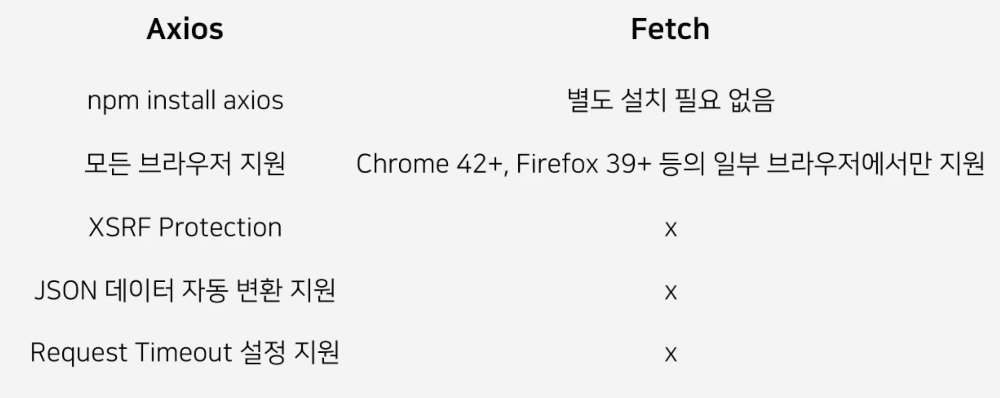

# yarn 사용하는 이유 : npm은 순차적으로 처리하고 yarn은 병렬로 처리하고 속도가 빠르다.

# Prettier
- 프리티어는 가독성을 좋게 만들어주는 확장 도구
- 균일한 코드 관리

yarn add dev -prettier
npm install -D prettier

# ESLint
- 자바스크립트를 분석해서 ㅗ류나 버그를 찾는 정적 분석 도구

```
yarn add --dev eslint eslint-config-prettier eslint-plugin-prettier
npm install -D eslint eslint-config-prettier eslint-plugin-prettier
```
- eslint-config-prettier : eslint에서 prettier와 충돌할 수 있는 rule 끄기
- eslint-plugin-prettier : prettier를 eslinit의 rules로 동작

# CSS in JS
리액트 2가지 방식으로 컴포넌트 스타일 적용
- CSS in CSS
    - 리액트 컴포넌트 별로 css 파일을 갖는 형식으로 스타일을 관리
    - CSS Module
    - 별도의 자바스크립트 전환이 필요 없어 속도가 빠름
- CSS in JS
    - JS 내에서 css를 작성하는 방식
    - 대표적으로 styled-component, emotion 등
    - 현재 사용 중인 스타일만 DOM에 포함
    - 별도 패키지를 설치하기 때문에 용량이 증가(스크립트 전환이 필요하여 속도도 느려짐)

# Emotion
- CSS in JS 라이브러리 중 1개
vs styled-component 큰 차이가 없다

```
yarn add @emotion/react @emotion/styled
npm install @emotion/react @emotion/styled
```

# Props
- 컴포넌트에 값을 넘겨주는 것
- 부모 컴포넌트 -> 자식 컴포넌트 데이터 전달
- 자식 컴포넌트 입장에서는 데이터를 받았기 때문에 수정 불가능

JS에서는 Props를 바로 사용이 가능하다. 하지만 TS에서는 타입을 지정해야 한다. 따라서 인터페이스를 만들어줘야 한다.
```javascript
interface Props{
    name: string;
    color: string; 
}

export const Hello = ({name, color}:Props) => {
    return <div style={{color}}>Hello {name}</div>;
};
```

```javascript
import Hello from './Hello';

function App() {
    return <Hello name={'Around Hub Studio'} color={'red'}></Hello>;
}
export default App;
```

# Optional Props
```javascript
interface Props{
    name: string;
    color?: string; 
}

export const Hello = ({name, color="blue"}:Props) => {
    return <div style={{color}}>Hello {name}</div>;
};
```

# State
- State는 리액트에서 이벤트에 의해 변경되는 동적인 값을 의미
- 한 컴포넌트 안에서 유동적인 데이터를 다룰 때 사용되며 컴포넌트 안에서 데이터를 변경할 수 있음
- Props는 부모 컴포넌트가 설정하는 값으로 읽기 전용으로만 사용했지만, State는 하위 컴포넌트에서도 데이터를 변경할 수 있는 특징이 존재
- State를 사용하기 위해서는 useState라는 Hook을 사용

```javascript
const [state, setState] = useState(initialState);
const [message, setMessage] = useState('');

const onChange = (event: React.ChangeEvent<HTMLInputElement>): void => {
    setState(event.target.value);
}
```
setState는 setter함수이기 때문에 다른 곳에서 호출하여 state값을 변경할 때 사용

# Context
- 계층적으로 내려가는 컴포넌트의 구조상 해당 prop이 필요없어도 자식 컴포넌트에게 전해주기 위해 가지고 있는 경우가 존재
- props drilling (props의 문제점)


- 컨텍스트란 리액트에서 Context눈 컴포넌트에게 Props를 사용하지 않고 필요한 데이터를 넘겨줄 수 있게 하는 기능
- 테마 설정, 언어 설정
- Context API 개념 - Context Provider, Context Consumer


Context를 사용하기 위해서는 아래와 같은 Context 생성

```javascript
const TodoContext = createContext<TodoListContextValueType | undefined>(
    undefined
);
```

Context에서 제공하는 Provider를 사용하는 컴포넌트 생성

```javascript
export const TodoProvider = (props: Props) => {
    ...

    return (
        <TodoContext.Provider value={values}>{props.children}</TodoContext.Provider>
    );
};
```

해당 Context를 사용하는 컴포넌트들의 상단에 Provider 컴포넌트를 씌워주기

```javascript
export const ContextExample = () => {
    return (
        <CountProvider>
            <CountLavbl />
            <PlusButton />
        </CountProvider>
    );
};
```

실제 Context의 값을 사용하는 곳에서 useContext를 활용하여 가져다 사용

```javascript
export const CountLabel = () => {
    const {count} = useContext(CountContext);
    return <div>{count}</div>;
};
```

- 주의사항 : Context의 값이 변경될 때마다 하위 컴포넌트들이 다시 랜더링된다. 성능에 영향을 준다.

# Layout

- 일반적인 페이지는 Header, Menu(Option), SideBar(Option), Content, Footer 구성

Header 컴포넌트
```javascript
export cosnt Header = () => {
    return (
        <Container>
            <Logo src='...' alt='Logo' />
            <Nav>
                <NavLink href='#'>Home</NavLink>
                <NavLink href='#'>About</NavLink>
                <NavLink href='#'>Services</NavLink>
                <NavLink href='#'>Contact</NavLink>
            </Nav>
        </Container>
    );
};
```

Footer 컴포넌트
```javascript
export cosnt Footer = () => {
    return (
        <FooterContainer>
            <FooterText>...</FooterText>
            <div>
                <SocialMediaLink href='#'>Facebook</SocialMediaLink>
                <SocialMediaLink href='#'>Twitter</SocialMediaLink>
                <SocialMediaLink href='#'>Instagram</SocialMediaLink>
            </div>
        </FooterContainer>
    );
};
```

Sidebar 컴포넌트
```javascript
export cosnt Sidebar = () => {
    return (
        <Container>
            <Menu>
                <MenuItem>
                    <MenuLink href='#'>Home</MennuLink>
                </MenuItem>
                <MenuItem>
                    <MenuLink href='#'>About</MennuLink>
                </MenuItem>
                <MenuItem>
                    <MenuLink href='#'>Services</MennuLink>
                </MenuItem>
                <MenuItem>
                    <MenuLink href='#'>Contact</MennuLink>
                </MenuItem>
            </Menu>
            <Info>
                <InfoTitle>Follow Us</InfoTitle>
                <InfoText>Stay connected with us</InfoText>
            </Info>
        </Container>
    );
};
```

Content 컴포넌트
```javascript
export cosnt Example1 = () => {
    return (
        <Container>
            <Title>Example 1</Title>
            <Content>
                <Card>
                    <Image
                        src='...',
                        alt='...'
                    />
                    <Text>...</Text>
                </Card>
                <Card>
                    <Image
                        src='...',
                        alt='...'
                    />
                    <Text>...</Text>
                </Card>
            </Content>
        </Container>
    );
};
```

Layout 구성 => 1개의 컴포넌트로 볼 수 있다
```javascript
export const Layout = (props: Props) => {
    return (
        <Container>
            <Header />
            <Content>
                <Sidebar />
                <Main>{props.children}</Main>
            </Content>
            <Footer />
        </Container>
    );
};
```

사용
```javascript
function App() {
    return (
        <Layout>
            <Example1 />
        </Layout>
    );
}
```

# Route
- 사용자가 URL을 통해 페이지를 접근할 경우 URL에 따른 다른 컴포넌트를 보여주기 위해 라우팅을 적용
- 리액트에서는 일반적으로 react-router 사용
- 뒤로가기 / 앞으로 가기 가능
- SSR로 구현 시, Next.js를 통해 해당 기능 구현

```
yarn add react-router-dom@6

yarn add react-router-dom @types/react-router-dom # 6버전 아래 케이스
```

최상단 <BrowserRouter> 컴포넌트를 덮어쓰기
```javascript
improt {BrowserRouter} from 'react-router-dom';

const root = ReactDOM.createRoot(
    document.getElementById('root') as HTMLElement
);
root.render(
    <React.StrintMode>
        <BrowserRouter> <<<
            <App />
        </BrowserRouter> >>>
    </React.StrintMode>
);
```

<Routes> 컴포넌트와 <Route> 컴포넌트를 사용하여 라우트를 설정
```javascript
function App() {
    return (
        <Layout>
            <Routes>
                <Route path='/' element={<Home />} />
                <Route path='/about' element={<About />} />
                <Route path='/example1' element={<Example1 />} />
                <Route path='/example2' element={<Example2 />} />
                <Route
                    path={'*'}
                    element={
                        <>
                            <NotFound>
                                404 <br /> NOT FOUND
                            </NotFound>
                        </>
                    }
                />
            </Routes>
        </Layout>
    );
}
```

react-router 에서 제공하는 <Link> 컴포넌트를 사용하여 페이지를 이동할 수 있게 링크 추가
```javascript
const MenuLink = styled(Link)`
    color: #333;
    text-decoration: none;
    font-size: 18px;

    &:hover {
        color: #4285f4;
    }
`;
```

```javascript
<MenuItem>
    <MenuLink to='/'>Home</MenuLink>
</MenuItem>
<MenuItem>
    <MenuLink to='/about'>About</MenuLink>
</MenuItem>
<MenuItem>
    <MenuLink to='/example1'>Example1</MenuLink>
</MenuItem>
<MenuItem>
    <MenuLink to='/example2'>Example2</MenuLink>
</MenuItem>
```

react-router에서 제공하는 useNavigate 훅을 사용하여 페이지를 이돌할 수 있게 만들 수 있다
```javascript
const navigate = useNavigate();

const handleClick = () => {
    navigate('/');
    scrollToTop();
};
```

```javascript
<button onClick={handleClick}>go home</button>
```

- Link vs useNavigate
  - Link 컴포넌트 : Link 컴포넌트는 a 태그를 대신하여 클라이언트 라우팅을 위해 사용, 사용자가 해당 링크를 클릭하면, 브라우저는 페이지를 새로 고치지 않고도 React Router가 관리하는 URL로 이동
  - useNavigate 훅 : useNavigate 훅은 함수 컴포넌트 내부에서 프로그래밍 방식으로 라우터를 제어, 주로 이벤트 핸들러나 조건부 또는 비동기적인 상황에서 특정 URL로 이동할 경우 사용, useNavigate 훅은 사용자의 액션을 기다리지 않고 바로 URl을 변경

# useEffect (훅 중 1개)
- useEffect는 리액트 컴포넌트가 랜더링 될 떄마다 특정 작업을 실행할 수 있도록 하는 리액트 Hook 중 1개
- 컴포넌트가 마운트, 언마운트, 업데이트 될때 특정 작업을 처리할 수 있음

useEffect 실행 시점
```javascript
// 컴포넌트가 렌더링 될 때마다 실행
useEffect(() => {
});

// 컴포넌트가 처음 렌더링 될 때 실행
useEffect(() => {
}, []);

// 컴포넌트가 처음 렌더링 될 때 실행 후 photos 값이 변경되면 re-rendering된 이후 실행
useEffect(() => {
}, [photos]);
```

사용 방법
```
useEffect(setup, dependencies?)
```
- setup : setup 영역에는 컴포넌트가 마운트(렌더링)될 때 동작할 로직을 추가할 수 있다. 이후 return 키워드를 사용하여 언마운트 상황에서 동작할 로직을 선택적으로 추가할 수 있다.
- dependencies : dependencies 영역은 setup 영역 내에서 참조되는 반응형 값들의 리스트를 정의할 수 있다. 이 값들은 props, state 들의 값들을 정의할 수 있다. 리액트는 이 값들을 비교하여 차이가 발생하면 다시 렌더링할 때마다 effect가 발동한다.
```javascript
function ChatRoom({roomId}) {
    const [serverUrl, setServerUrl] = useState('주소...');

    useEffect(() => {
        // 마운트(렌더링) 될 떄
        const connection = createConnection(serverUrl, roomId);
        connection.connect();

        // 언마운트 될 때
        return () => {
            connection.disconnect();
        };
    }, [serverUrl, roomId]); // serverUrl, roomId가 변경 시 useEffect 다시 실행
}
```

https://jsonplaceholder.typicode.com/

# Fetch API
- JS의 내장 객체이며 API를 호출하는 역할을 수행
```javascript
useEffect(() => {
    fetch('https://jsonplaceholder.typicode.com/photos')
        .then((response) => response.json())
        .then((data) => setPhotos(data.slice(0, 4)))
        .catch((error) => console.error(error));
}, []);
```

Fetch API 구조
```javascript
fetch('url', {
    method: 'POST',
    headers: {
        'Content-Type': 'application.json'
    },
    body: JSON.stringify(photos),
    mode: 'cors',
    credentials: 'include',
    cache: 'no-cache'
})
    .then((response) => response.json())
    .catch((error) => console.error(error));
```

fetch()는 Promise객체를 return하기 때문에 then 함수를 사용하여 response를 받아 추가 작업을 수행하면 된다.
```javascript
useEffect(() => {
    fetch('https://jsonplaceholder.typicode.com/photos')
        .then((response) => response.json())
        .then((data) => setPhotos(data.slice(0, 4)))
        .catch((error) => console.error(error));
}, []);
```

then 대신에 async와 await를 사용할 수 있다.
```javascript
async function fetchPhotos() {
    // 호출 결과를 로딩중인지 아닌지 판단할 수 있는 로직을 추가해볼 수 있음
    const response = await fetch('https://jsonplaceholder.typicode.com//photos');
    if (!response.ok) {
        throw new Error('Error');
    }

    const paredData = await response.json();
    const transformedPhotos = paredData.slice(0, 4);

    return transformedPhotos;
}
```

# Axios
- Axios는 Promise 기반의 Http client 패키지
- async/await을 활용할 떄 더욱 쉽게 구현



```
yarn add axios
npm install axios
```

사용방법
```javascript
axios
    .get('주소...')
    .then((response) => {
        console.log(response.data);
    })
    .catch((error) => {
        console.error(error);
    })
    .finally(() => { // 마무리 동작 코드
        console.log('finally statement');
    });
```

await 사용 시 간단히 사용
```javascript
const response = await axios.get(
    '주소...'
);
setTodos(response.data);
```

요청 전, 응답을 받은 후 공통으로 수행해야 하는 작업이 있다면 인터셉터를 적용하여 처리할 수 있음
```javascript
jsonPlaceholderRequest.interceptors.request.use(
    (config) => {
        console.log('호출 전 수행할 작업');
        return config;
    },
    (error) => {
        return Promise.reject(error);
    }
);
```