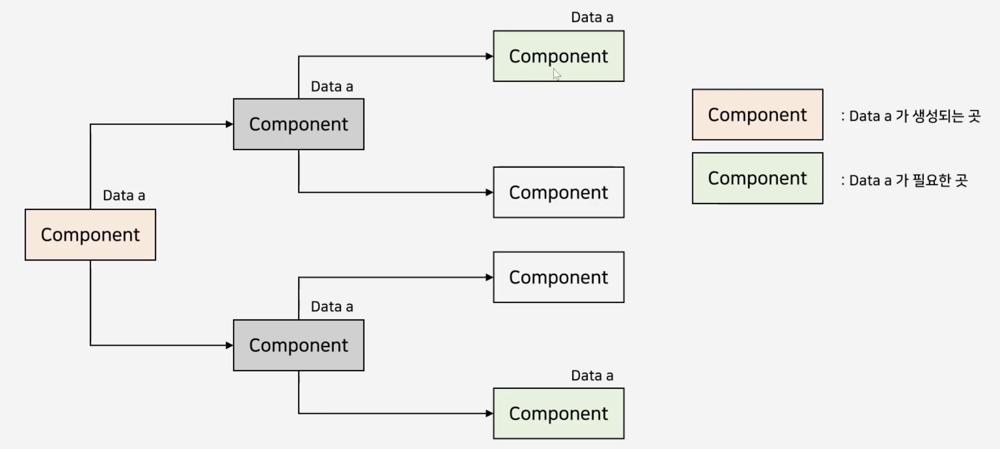
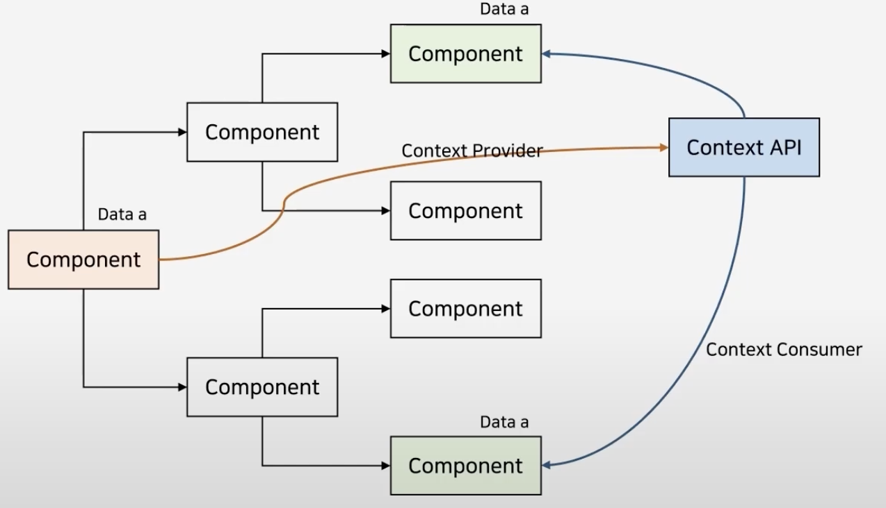

# yarn 사용하는 이유 : npm은 순차적으로 처리하고 yarn은 병렬로 처리하고 속도가 빠르다.

# Prettier
- 프리티어는 가독성을 좋게 만들어주는 확장 도구
- 균일한 코드 관리

yarn add dev -prettier
npm install -D prettier

# ESLint
- 자바스크립트를 분석해서 ㅗ류나 버그를 찾는 정적 분석 도구

```
yarn add --dev eslint eslint-config-prettier eslint-plugin-prettier
npm install -D eslint eslint-config-prettier eslint-plugin-prettier
```
- eslint-config-prettier : eslint에서 prettier와 충돌할 수 있는 rule 끄기
- eslint-plugin-prettier : prettier를 eslinit의 rules로 동작

# CSS in JS
리액트 2가지 방식으로 컴포넌트 스타일 적용
- CSS in CSS
    - 리액트 컴포넌트 별로 css 파일을 갖는 형식으로 스타일을 관리
    - CSS Module
    - 별도의 자바스크립트 전환이 필요 없어 속도가 빠름
- CSS in JS
    - JS 내에서 css를 작성하는 방식
    - 대표적으로 styled-component, emotion 등
    - 현재 사용 중인 스타일만 DOM에 포함
    - 별도 패키지를 설치하기 때문에 용량이 증가(스크립트 전환이 필요하여 속도도 느려짐)

# Emotion
- CSS in JS 라이브러리 중 1개
vs styled-component 큰 차이가 없다

```
yarn add @emotion/react @emotion/styled
npm install @emotion/react @emotion/styled
```

# Props
- 컴포넌트에 값을 넘겨주는 것
- 부모 컴포넌트 -> 자식 컴포넌트 데이터 전달
- 자식 컴포넌트 입장에서는 데이터를 받았기 때문에 수정 불가능

JS에서는 Props를 바로 사용이 가능하다. 하지만 TS에서는 타입을 지정해야 한다. 따라서 인터페이스를 만들어줘야 한다.
```javascript
interface Props{
    name: string;
    color: string; 
}

export const Hello = ({name, color}:Props) => {
    return <div style={{color}}>Hello {name}</div>;
};
```

```javascript
import Hello from './Hello';

function App() {
    return <Hello name={'Around Hub Studio'} color={'red'}></Hello>;
}
export default App;
```

# Optional Props
```javascript
interface Props{
    name: string;
    color?: string; 
}

export const Hello = ({name, color="blue"}:Props) => {
    return <div style={{color}}>Hello {name}</div>;
};
```

# State
- State는 리액트에서 이벤트에 의해 변경되는 동적인 값을 의미
- 한 컴포넌트 안에서 유동적인 데이터를 다룰 때 사용되며 컴포넌트 안에서 데이터를 변경할 수 있음
- Props는 부모 컴포넌트가 설정하는 값으로 읽기 전용으로만 사용했지만, State는 하위 컴포넌트에서도 데이터를 변경할 수 있는 특징이 존재
- State를 사용하기 위해서는 useState라는 Hook을 사용

```javascript
const [state, setState] = useState(initialState);
const [message, setMessage] = useState('');

const onChange = (event: React.ChangeEvent<HTMLInputElement>): void => {
    setState(event.target.value);
}
```
setState는 setter함수이기 때문에 다른 곳에서 호출하여 state값을 변경할 때 사용

# Context
- 계층적으로 내려가는 컴포넌트의 구조상 해당 prop이 필요없어도 자식 컴포넌트에게 전해주기 위해 가지고 있는 경우가 존재
- props drilling (props의 문제점)



- 컨텍스트란 리액트에서 Context눈 컴포넌트에게 Props를 사용하지 않고 필요한 데이터를 넘겨줄 수 있게 하는 기능
- 테마 설정, 언어 설정
- Context API 개념 - Context Provider, Context Consumer



Context를 사용하기 위해서는 아래와 같은 Context 생성

```javascript
const TodoContext = createContext<TodoListContextValueType | undefined>(
    undefined
);
```

Context에서 제공하는 Provider를 사용하는 컴포넌트 생성

```javascript
export const TodoProvider = (props: Props) => {
    ...

    return (
        <TodoContext.Provider value={values}>{props.children}</TodoContext.Provider>
    );
};
```

해당 Context를 사용하는 컴포넌트들의 상단에 Provider 컴포넌트를 씌워주기

```javascript
export const ContextExample = () => {
    return (
        <CountProvider>
            <CountLavbl />
            <PlusButton />
        </CountProvider>
    );
};
```

실제 Context의 값을 사용하는 곳에서 useContext를 활용하여 가져다 사용

```javascript
export const CountLabel = () => {
    const {count} = useContext(CountContext);
    return <div>{count}</div>;
};
```

- 주의사항 : Context의 값이 변경될 때마다 하위 컴포넌트들이 다시 랜더링된다. 성능에 영향을 준다.